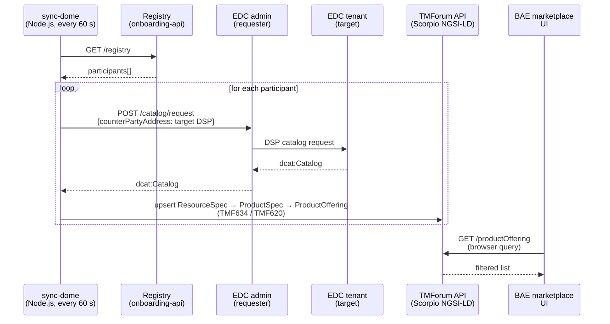
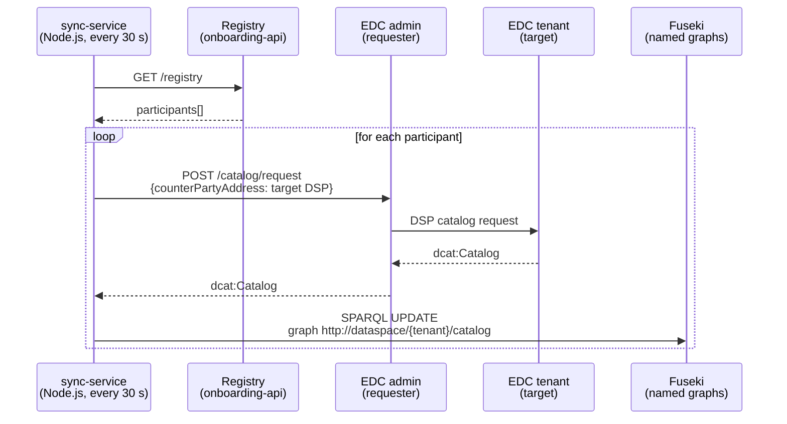
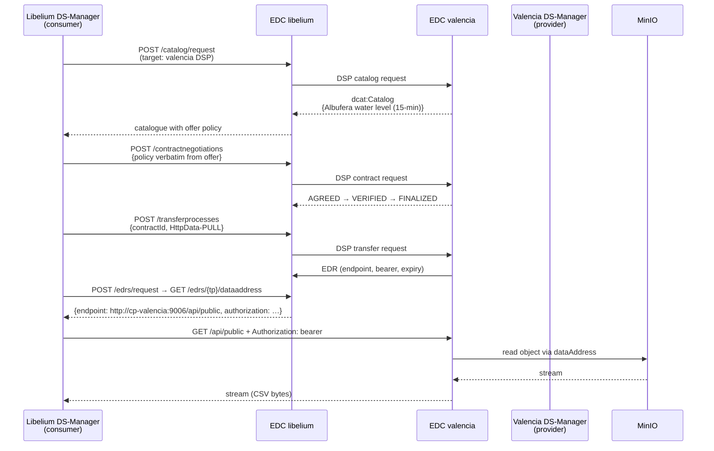

# CitCom.ai — Architecture

## 1. Scope and positioning

CitCom.ai is a **multi-tenant data space** that lets organisations
publish data assets, discover assets published by other participants,
negotiate machine-readable usage policies, and exchange the data under
those agreements.

It is built on the **Eclipse Dataspace Components (EDC)** open-source
project (Eclipse Foundation), which we deploy through the
[Sovity Community Edition 16.4.2](https://github.com/sovity/edc-ce)
distribution (`ghcr.io/sovity/edc-ce:16.4.2`). On top of EDC, we layer:

* **DS-Manager** — backend (FastAPI) + frontend (React) by Hopu
  (`registry.hopu.eu/dsr-backend:1.3.4-generic-ds`,
  `registry.hopu.eu/dsr-frontend:1.3.3-generic-ds`). DS-Manager is the
  human-facing management plane: identity, asset metadata, policy
  drafting, federated catalogue browsing, audit. It speaks to EDC over
  EDC's Management API. Container names and Keycloak identifiers carry
  the legacy `dsr-*` prefix (Hopu's original "Data Space Ready" brand);
  we keep those verbatim everywhere they're a runtime literal.
* **An onboarding portal** (`onboarding-api`, Flask) for tenant
  registration, the participant registry and SMTP delivery of
  activation emails.
* **A federated catalogue**. Two interchangeable backends are
  supported and the choice is per–data-space (`CATALOG_BACKEND` env):
  DCAT in Apache Jena Fuseki for SPARQL access, or TMForum/DOME
  product offerings in Scorpio NGSI-LD for a marketplace-style browse
  UX. **CitCom is wired to the DOME stack** (`CATALOG_BACKEND=tmforum`).
  Both pipelines are populated by sync workers that poll every
  connector's EDC catalogue every 30–60 s.
* **Object storage** (MinIO, S3-compatible) with a per-tenant bucket
  served behind an authenticated portal.
* **Identity** anchored on Keycloak as the OIDC issuer, plus DS-Manager-level
  DIDs (`did:web:<subdomain>.<domain>:did:<uuid>`) for participants and
  per-tenant LEAR designations.
* **Reverse proxy + TLS** via Traefik, with per-host Let's Encrypt
  certificates issued through the Cloudflare DNS-01 challenge.

The result is a deployment where each tenant gets its **own subdomain**,
its **own EDC connector**, its **own DS-Manager instance** (so policy
state and audit are tenant-isolated), and its **own MinIO bucket**, but
shares the Keycloak realm, the catalogue index and the onboarding
landing page.

## 2. Component model

```mermaid
flowchart LR
  subgraph user["End user (browser)"]
    direction TB
    U[Operator/<br/>Asset owner]
  end

  subgraph traefik["Traefik (TLS termination, host routing)"]
    direction TB
    T[Traefik<br/>+ LE DNS-01]
  end

  subgraph onboarding["Main domain — onboarding"]
    direction TB
    NG_main[nginx-main<br/>portal + DS-Manager fallback]
    OA[onboarding-api<br/>Flask + SMTP]
    KC[Keycloak<br/>realm=DSR]
    REG[Participant<br/>registry.json]
    SYNC1[sync-fuseki]
    SYNC2[sync-dome]
    FUSEKI[Apache Jena<br/>Fuseki SPARQL]
    NGSI[Scorpio<br/>NGSI-LD]
    BAE[BAE/DOME<br/>marketplace UI]
    TMFP[TMForum<br/>productCatalog]
    TMFR[TMForum<br/>resourceCatalog]
    TMFS[TMForum<br/>serviceCatalog]
  end

  subgraph admin["admin.citcom.dataspaceready.eu"]
    direction TB
    NG_admin[nginx-admin]
    DSR_admin[dsr-backend-dev<br/>shared compliance]
    EDC_admin[cp-admin<br/>EDC connector]
  end

  subgraph tenant["{tenant}.citcom.dataspaceready.eu (× N)"]
    direction TB
    NG_t[nginx-tenant<br/>+ tenant-validator]
    DSR_t[dsr-backend-{t}<br/>+ frontend]
    EDC_t[cp-{t}<br/>EDC connector<br/>Sovity-CE 16.4.2]
    PG_t[(Postgres<br/>per tenant)]
  end

  subgraph storage["Storage (shared, X-Participant gated)"]
    direction TB
    MINIO[MinIO]
    SP[storage-portal]
  end

  U -->|HTTPS| T
  T --> NG_main
  T --> NG_admin
  T --> NG_t
  NG_main --> OA
  NG_main --> KC
  NG_main --> BAE
  NG_main --> FUSEKI
  NG_main --> TMFP
  NG_main --> TMFR
  OA -.writes.-> REG
  NG_t --> DSR_t
  NG_t --> SP
  NG_t -->|auth_request| OA
  NG_admin --> DSR_admin
  DSR_t -->|management API| EDC_t
  DSR_admin -->|management API| EDC_admin
  DSR_t -->|OIDC validate| KC
  EDC_t -.DSP federation.- EDC_admin
  EDC_t -.DSP federation.- EDC_t
  SYNC1 -->|poll catalog| EDC_admin
  SYNC1 -->|poll catalog| EDC_t
  SYNC1 -->|TURTLE upsert| FUSEKI
  SYNC2 -->|poll catalog| EDC_admin
  SYNC2 -->|poll catalog| EDC_t
  SYNC2 -->|TMF620| TMFP
  SP --> MINIO
```

> See [`diagrams/architecture-overview.excalidraw`](diagrams/architecture-overview.excalidraw)
> for an editable version of the same picture.

## 3. The Eclipse EDC role

For each tenant we run **one EDC connector** (`cp-{tenant}`), based on
`ghcr.io/sovity/edc-ce:16.4.2`. The connector exposes four HTTP
endpoint groups, each on its own port:

| Group | Port | Purpose | Who calls it |
|---|---|---|---|
| Management | 8181 | Asset / policy / contract definition / catalogue / negotiation / transfer CRUD | DS-Manager backend, sync workers, deploy scripts |
| Protocol (DSP) | 9084 | Eclipse Dataspace Protocol — federated catalogue, contract negotiation, transfer authorisation | Other connectors |
| Public (data plane) | 9006 | Bearer-protected data egress for `HttpData-PULL` transfers | Consumer once it has an EDR |
| Control | 9241 | Internal control plane (data-plane-management) | Connector internals only |

The connector is configured in pure code (no UI of its own); we drive
it from DS-Manager.

### What runs inside an EDC connector

* **DSP catalog** — answers `dcat:Catalog` queries with the connector's
  visible offerings. Each `dcat:dataset` carries a `dcat:distribution`
  list (HttpData-PULL, HttpData-PUSH, S3-PUSH, AzureStorage-PUSH) and
  an `odrl:hasPolicy` referring to the associated ContractDefinition.
* **Contract negotiation** — implements the Dataspace Protocol state
  machine (REQUESTED → AGREED/VERIFIED → FINALIZED). Validates that
  the offer the consumer requests matches what's in the catalogue
  (offer policy, target asset, assigner).
* **Transfer process** — once a contract is finalized, allocates an
  EDR (Endpoint Data Reference) — a one-time bearer token + URL that
  the consumer uses to pull the data plane.
* **Data plane** — for `HttpData-PULL`, fronts the asset's
  `dataAddress` (HTTP, S3, etc.) so the consumer never sees the raw
  storage credentials.

### Data addresses we currently support

`AssetCreate` requests in DS-Manager map straight to EDC `dataAddress`
fields. The most common shapes:

* `HttpData` (open or with `bearer`/`apiKey` auth) — the asset is
  served from any HTTP endpoint reachable by the provider connector.
* `AmazonS3` — the asset lives in an S3-compatible bucket. We use
  `endpointOverride: http://minio:9000` to target the in-cluster
  MinIO.
* The internal `http://storage/edc/{tenant}/{object}` URL — a
  shorter-form HttpData address served by the storage portal's
  internal `/edc/<tenant>/...` route. Reachable only from the docker
  network so it never leaks outside the data plane.

## 4. Federated catalogue

The platform supports **two interchangeable catalogue backends**, both
populated by polling each connector's EDC catalogue every 30–60 s. The
choice is per–data-space, set with `CATALOG_BACKEND` in the project's
`env.<env>` file:

| Value | Index | Browsable from | Use when |
|---|---|---|---|
| `sparql` | Apache Jena Fuseki + DCAT (one named graph per tenant) | `/catalog/` connector-ui (SPARQL UI) | Audience is data-engineering / RDF-native; you want raw SPARQL access to the federated metadata. |
| `tmforum` | Scorpio NGSI-LD + TMForum APIs (TMF620 productCatalog, TMF634 resourceCatalog, TMF638 serviceCatalog) | `/dome-catalog/` BAE marketplace UI + `/catalog/` connector-ui in TMForum mode | Audience is a marketplace / business user; you want a richer browse + filter UX and TMForum-shaped product offerings. |

The two are functionally redundant — every dataset that reaches one
also reaches the other if both are wired up — but in practice each
deployment picks the one that matches its audience.

> **CitCom is configured with `CATALOG_BACKEND=tmforum`**, so the
> active federated catalogue is the DOME stack (Scorpio NGSI-LD + the
> TMForum API gateway in front of it, with the BAE marketplace UI as
> the human-facing browser at
> `https://citcom.dataspaceready.eu/dome-catalog/`).
>
> The Fuseki/SPARQL pipeline (4.1 below) still runs in the cluster as
> a fallback / engineering surface — it's cheap and useful for
> debugging — but it is **not** what citcom users see.

### 4.1 TMForum / DOME (active in CitCom)

A worker (`sync-dome`, Node.js, every 60 s by default) walks each
connector listed in the participant registry, fetches its DCAT
catalogue via DSP, maps each dataset to a TMForum triplet
**ResourceSpecification → ProductSpecification → ProductOffering**,
and upserts the result into the **TMForum API gateway** in front of
the **Scorpio NGSI-LD** broker. The same worker also reports its
liveness to `onboarding-api`'s `/sync-status` so the catalogue page
shows "last updated <Y>s ago" to the user.



Human-facing browser: the **BAE / DOME marketplace** at
`https://citcom.dataspaceready.eu/dome-catalog/` (and a TMForum-mode
build of `connector-ui` at `/catalog/` that hits the same TMForum API
endpoints rather than SPARQL).

### 4.2 DCAT / SPARQL (Apache Jena Fuseki — alternative backend)

This is the path you'd pick if your audience is RDF-native or you want
a programmable SPARQL surface across the whole data space. CitCom
doesn't expose this to end users, but the pipeline runs in the cluster
as a parallel index — useful for debugging and as a fallback.



When a project sets `CATALOG_BACKEND=sparql`, the `connector-ui` at
`/catalog/` switches to a SPARQL-mode build that issues federated
queries directly against Fuseki for the union of all tenant graphs.

## 5. Identity model

```mermaid
flowchart TB
  subgraph kc[Keycloak realm DSR]
    direction TB
    DSRAPP[client: dsr-app<br/>shared template]
    DSRTLIB[client: dsr-app-libelium<br/>confidential]
    DSRTVAL[client: dsr-app-valencia<br/>confidential]
    DSRTUPV[client: dsr-app-upv<br/>confidential]
    PORTAL[client: ds-portal<br/>onboarding portal]
    USERS[Users in groups<br/>libelium, valencia, upv<br/>roles: dsr:asset-owner, dsr:operator]
  end

  subgraph dsr_t[DS-Manager per tenant]
    direction TB
    DID[/api/v1/dids/<br/>did:web:&lt;subdomain&gt;.&lt;domain&gt;:did:&lt;uuid&gt;]
    ORG[/api/v1/orgs/<br/>org_id, legal_name, headquarter_address]
    LEAR[/api/v1/orgs/&lt;id&gt;/lear<br/>designates user_did → org]
  end

  USERS -->|password grant| DSRTLIB
  DSRTLIB -->|access_token| dsr_t
  dsr_t --> DID
  dsr_t --> ORG
  dsr_t --> LEAR
```

* **Keycloak** is the identity issuer. It hosts a single realm
  (`DSR`), one shared template client (`dsr-app`) used by the portal,
  one confidential client per tenant (`dsr-app-{tenant}`) used by that
  tenant's DS-Manager backend, and a `ds-portal` client for the main-domain
  portal.
* The per-tenant client is **provisioned automatically by
  `provision-tenant.py`** and kept in sync (mappers, scopes, flags)
  with `dsr-app` on every re-run.
* **DS-Manager DIDs** are filesystem-style `did:web:` documents served from
  `/did/<id>/x509CertificateChain.pem`. Every user gets a personal
  DID; every Org gets one too. The LEAR (Legal Entity Appointed
  Representative) link maps a user DID to an org DID, which is what a
  consumer's connector verifies during contract negotiation.

## 6. Transfer flow (the path Albufera CSV took)



> See [`diagrams/transfer-flow.excalidraw`](diagrams/transfer-flow.excalidraw)
> for an editable version of the same sequence.

Two notes from the implementation:

1. The `policy` block sent in `POST /contractnegotiations` MUST
   include `odrl:` JSON-LD prefixes (`@type: odrl:Offer`, `odrl:target`,
   `odrl:assigner`). If you ship it under the EDC default `@vocab`, EDC
   validates `@type` as `https://w3id.org/edc/v0.0.1/ns/Offer` and
   rejects.
2. The provider uses the consumer's verified DID/Org as the input to
   policy evaluation. With our open `albufera-open-use` policy
   (USE-only, no constraints) any verified consumer of any participant
   passes. With ABAC policies you can restrict per-attribute (LEAR,
   organisation country, etc.).

## 7. Per-tenant data isolation

| Layer | Mechanism |
|---|---|
| HTTP routing | One `nginx-{tenant}` per subdomain; `tenant-validator` calls strict mode for the storage portal so a session for tenant A cannot read tenant B's bucket. |
| Storage | `nginx-tenant.conf` injects `X-Participant: {tenant}` so the storage-portal serves only that bucket. Internal `/edc/<tenant>/` routes are blocked at the public gateway and only reachable from the docker network. |
| Identity | DS-Manager backend authenticates against `dsr-app-{tenant}` confidential client; `resource_access.dsr-app-{tenant}.roles` is the only role path it trusts. |
| Catalog | Sync workers write each tenant's catalogue to its own SPARQL named graph and its own TMForum tenant header. |
| Database | One `dsr-postgres-{tenant}` and one `db-{tenant}` (EDC). Per-tenant compose generated by `provision-tenant.py`. |

## 8. References

* Eclipse EDC project: <https://github.com/eclipse-edc/Connector>
* Sovity Community Edition (the distribution we run): <https://github.com/sovity/edc-ce>
* DSP (Dataspace Protocol) spec: <https://docs.internationaldataspaces.org/ids-knowledgebase/v/dataspace-protocol/>
* ODRL (used for policy syntax): <https://www.w3.org/TR/odrl-model/>
* DCAT (catalogue vocabulary): <https://www.w3.org/TR/vocab-dcat-3/>
* TMForum APIs (the marketplace catalogue): <https://www.tmforum.org/oda/open-apis/>
* CitCom.ai (the Testing & Experimentation Facility funding the
  pilot): <https://citcom.ai/>
