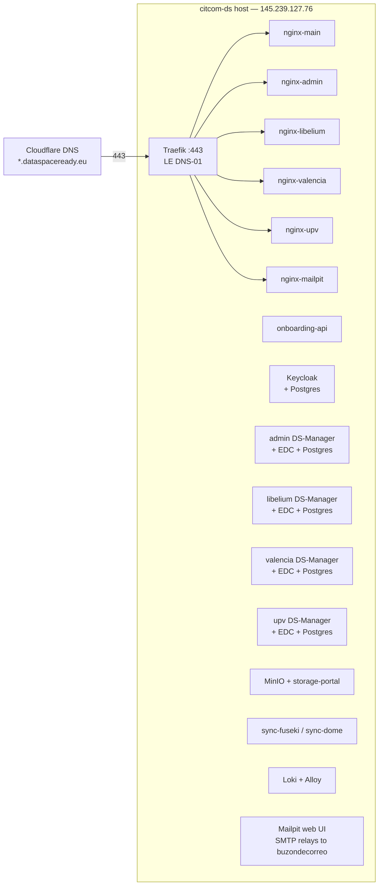

# CitCom.ai — Deployment

This is the operational guide for the CitCom data space at
`https://citcom.dataspaceready.eu`. It assumes you've read
[`architecture.md`](architecture.md) for the *what*; this doc focuses
on the *how*.

## 1. Topology



- **Server:** `145.239.127.76` (`citcom-ds`), Ubuntu, user `ubuntu`.
- **Deploy directory:** `~/citcom/` (rsync target — not a git
  worktree).
- **Single Docker network:** `edc-net` (external; created on first
  deploy).
- **Persistent state:** Docker volumes for each Postgres and MinIO
  instance + the Traefik ACME store.
- **DNS:** Wildcard `*.citcom.dataspaceready.eu` in Cloudflare → host
  IP. The `traefik-cloudflare-companion` sidecar registers any new
  Traefik host label automatically, so a new tenant subdomain
  resolves without manual DNS work.
- **TLS:** Per-host Let's Encrypt certs via the Cloudflare DNS-01
  challenge (no port-80 challenge → wildcard-friendly + does not
  break HTTP→HTTPS redirect).

## 2. The deploy command

A full deploy from a developer machine is one line:

```bash
make deploy-prod-remote PROJECT=citcom
```

What it does:

1. **rsync** the repo (excluding `.git/`, `active/`, secrets) to
   `ubuntu@citcom-ds:~/citcom/`.
2. **ssh** into the host and run `make deploy-prod PROJECT=citcom`,
   which is a thin wrapper for `make deploy ENV=production
   PROJECT=citcom SSL=skip`.
3. **smoke test** with `curl https://citcom.dataspaceready.eu/`.

The `make deploy` target itself does, in order:

1. `make activate` — render `active/` from `platform/` + `projects/citcom/`
   + `env.production` + `tenants.yml`. This regenerates
   `active/keycloak/realm-export.json`, every tenant compose under
   `active/tenants/`, the Keycloak theme, the navbar config, etc.
2. Fix file permissions (`chmod -R o+rX active/`) so containers can
   read bind-mounted assets.
3. **Pull all images** referenced by every compose file. Hopu
   re-publishes `1.3.x-generic-ds` regularly with the same tag, so a
   blind `docker compose up -d` would silently keep the old digest;
   we explicitly pull first.
4. Bring up the platform: Traefik (with `docker-compose.cloudflare.yml`
   and `docker-compose.traefik-le.yml` overlays when
   `CLOUDFLARE_ENABLED=true`), then `docker-compose.yml`,
   then MinIO (`docker-compose-minio.yml`), then the admin connector
   (`docker-compose-tenant-admin.yml`), then every per-tenant compose
   under `active/tenants/`.
5. **Force-recreate every nginx gateway**. Their config is bind-mounted
   from `active/nginx/*.conf.template` so a vanilla `up -d` doesn't
   pick up template changes.
6. **Force-recreate Keycloak**. Same bind-mount problem (the
   themes directory and `realm-export.json` are mounted; `make
   activate` removes and recreates those files, so the inode under the
   old container is stale).
7. Bring up the audit pipeline (Loki + Alloy).
8. **Run `keycloak_sync.py`** (self-heal). Reconciles realm-level
   fields, mappers and per-client redirect URIs against
   `active/keycloak/realm-export.json`. Self-heals admin password
   drift via fallback-and-rotate. Idempotent — second run is a no-op.
9. **Run `register-admin-connector.py`** to ensure the `admin`
   connector exists in the admin DS-Manager's `connector_registry.ds_connector`.
10. Print URLs and exit.

## 3. Provisioning a new tenant

Tenants are declared in [`tenants.yml`](../tenants.yml). Each entry
covers identity, EDC, contact, users and (optional but recommended)
`org_details` for the DS-Manager Organisation registry:

```yaml
- name: libelium             # used as connector / db / k8s-style identifier
  subdomain: libelium        # https://libelium.citcom.dataspaceready.eu
  org: Libelium              # display name
  sector: Technology
  contact:
    name: Mateo Ferri
    email: m.ferri@libelium.com
    role: Data Engineer
  edc:
    api_key: api-key-libelium  # X-Api-Key for the connector's management API
    public_port: 9005          # internal port for the connector's data plane
  org_details:
    vat: ESB99065815
    street: Calle Bari 19, Edificio CEEI
    city: Zaragoza
    postal: "50197"
    subdivision: ES-Z          # ISO-3166-2 — the DS-Manager backend rejects anything else
    country: ES
  users:
    - email: m.ferri@libelium.com
      password: ...
      first_name: Mateo
      last_name: Ferri
      roles: [dsr:asset-owner, dsr:operator]
```

Then:

```bash
# After editing tenants.yml on a deployed host:
cd ~/citcom
ln -sf active/env env                      # provision-tenant.py reads cwd/env
ln -sf active/tenants.yml tenants.yml      # ... and cwd/tenants.yml
python3 platform/scripts/provision-tenant.py <tenant-name> --skip-verify
# or do all at once:
python3 platform/scripts/provision-tenant.py --all --skip-verify
```

`provision-tenant.py` performs **9 idempotent steps** per tenant:

1. Generate `active/tenants/docker-compose-tenant-<name>.yml`.
2. Add the tenant subdomain to the `dsr-app` redirect URIs.
3. Create or **self-heal** the per-tenant OIDC client (`dsr-app-<name>`)
   — re-applies all 5 protocol mappers and copies the 8 default + 1
   optional client scopes from `dsr-app` even when the client already
   exists, fixing accumulated drift.
4. Start the tenant containers (or `--skip-containers` if they're
   already up after a `make deploy`).
5. Create the Keycloak group + each declared user, attach roles.
6. Register the EDC connector in the tenant DS-Manager's
   `connector_registry.ds_connector` (HTTP API first, falls back to
   direct Postgres insert).
7. Identity setup (DID + Organisation + LEAR designation). **This step
   runs inside the `onboarding-api` container** so all the HTTP calls
   resolve through the internal Docker DNS — running on the host
   silently fails because the public domain doesn't loop back.
8. Add the new connector's catalogue endpoints to the sync-service
   compose so the federated catalogue picks it up.
9. Endpoint smoke check (skipped with `--skip-verify`).

## 4. Self-healing

Two self-healers run on every deploy:

* **`platform/scripts/keycloak_sync.py`** — reconciles the running
  Keycloak realm with the rendered `active/keycloak/realm-export.json`
  (themes, SMTP, locale, mappers, redirect URIs). Auto-rotates the
  admin password if the value in `env.production` no longer
  authenticates and a known fallback (e.g. `admin`) does.
* **`platform/onboarding-api/register-admin-connector.py`** — ensures
  the admin EDC connector is registered in the admin DS-Manager's
  `connector_registry.ds_connector`. SQL-direct (the previous
  `/test-auth/create-session` endpoint was removed in dsr-backend
  1.3.4).

Both are idempotent and non-fatal: a deploy succeeds even if either
fails.

## 5. Service inventory

| Container | Image | Purpose |
|---|---|---|
| `traefik` | `traefik:latest` | TLS termination, host-based routing, ACME (LE) via Cloudflare DNS-01 |
| `cloudflare-companion` | `tiredofit/traefik-cloudflare-companion:latest` | Auto-register DNS records for every Traefik host label |
| `nginx-main` | `nginx:1.25-alpine` | Onboarding portal, `/catalog/`, `/registry/`, DS-Manager fallback |
| `nginx-admin` | `nginx:1.25-alpine` | `admin.<domain>` — admin DS-Manager proxy |
| `nginx-mailpit` | `nginx:1.25-alpine` | `mailpit.<domain>` (debug catcher; SMTP egress is real) |
| `nginx-{tenant}` | `nginx:1.25-alpine` | One per tenant subdomain |
| `tenant-validator` | custom (FastAPI) | nginx `auth_request` subhandler — validates session against DS-Manager backend, gates `/storage/` strictly |
| `onboarding-api` | custom (Flask) | Participant registry, `/auth/*` portal, activation emails (SMTP), provision API |
| `dsr-keycloak-dev` + `dsr-keycloak-db-dev` | `quay.io/keycloak/keycloak:26.4` + `postgres:15-alpine` | OIDC issuer |
| `dsr-frontend-{tenant}` | `registry.hopu.eu/dsr-frontend:1.3.3-generic-ds` | Per-tenant DS-Manager UI |
| `dsr-backend-{tenant}` | `registry.hopu.eu/dsr-backend:1.3.4-generic-ds` | Per-tenant DS-Manager API (assets, policies, identity) |
| `cp-{tenant}` | `ghcr.io/sovity/edc-ce:16.4.2` | Eclipse EDC connector per tenant |
| `dsr-postgres-{tenant}` + `db-{tenant}` | `postgres:15-alpine` | DS-Manager + EDC databases per tenant |
| `dsr-redis-{tenant}` | `redis:7-alpine` | DS-Manager session store per tenant |
| `dsr-did-init-{tenant}` | one-shot | Generates DID material on first start |
| `cp-admin` + `db-admin` | EDC + postgres | Shared admin connector |
| `dsr-backend-dev` + `dsr-postgres-dev` + `dsr-redis-dev` | DS-Manager | Admin DS-Manager (compliance / sync centre) |
| `dsr-frontend-dev` | `registry.hopu.eu/dsr-frontend:1.3.3-generic-ds` | Admin DS-Manager UI |
| `minio` + `minio-init` | MinIO | Object storage with per-bucket per-tenant separation |
| `storage-portal` | custom (Flask + minio-py) | Authenticated upload/list UI per tenant; X-Participant header gates the bucket |
| `http-source`, `http-sink` | nginx + node | Test-data servers used in transfer demos |
| `fuseki` | Apache Jena | DCAT catalogue index |
| `scorpio` + `dome-postgres` + `tmforum-{product,resource,service}-catalog` | DOME | TMForum API stack |
| `bae-frontend` | DOME marketplace UI | Browseable product catalogue |
| `sync-service` (a.k.a. `sync-fuseki`) | `node:20-alpine` | Polls every connector's DCAT catalogue → Fuseki SPARQL |
| `sync-dome` | `node:20-alpine` | Polls every connector → TMForum |
| `mailpit` | `axllent/mailpit:latest` | Local SMTP catcher (debug) |
| `dsr-loki-dev` + `dsr-alloy-dev` | Loki + Grafana Alloy | Audit log aggregation |

## 6. Self-issued certificates

The Traefik service is configured to issue per-host certs through the
Cloudflare DNS-01 challenge. The flag chain:

```
--certificatesresolvers.le.acme.email=...
--certificatesresolvers.le.acme.storage=/acme/acme.json
--certificatesresolvers.le.acme.dnschallenge=true
--certificatesresolvers.le.acme.dnschallenge.provider=cloudflare
--certificatesresolvers.le.acme.dnschallenge.resolvers=1.1.1.1:53,8.8.8.8:53
```

Each routed service ships a label `traefik.http.routers.<name>.tls.certresolver=${TRAEFIK_CERTRESOLVER:-}`,
which evaluates to `le` in production (where the env sets it) and to
empty in local dev (where Traefik falls back to the file provider's
self-signed wildcard). Adding a new tenant therefore needs no manual
cert work — Traefik issues one on the first request to its host.

## 7. SMTP / email

`onboarding-api` sends activation emails directly through SMTP (it does
**not** delegate to Keycloak's mailing). Production points at
`smtp.buzondecorreo.com:465` SSL, authenticated as
`info@geospace.es` — recipients see the message as
`From: CitCom.ai <info@geospace.es>`. The HTML template lives at
[`platform/onboarding-api/templates/activation-email.html`](../../../platform/onboarding-api/templates/activation-email.html)
and is parametrised entirely from env (`EMAIL_PRIMARY_COLOR`,
`EMAIL_ACCENT_COLOR`, `EMAIL_LOGO_FILE`, …) so each project's emails
match its login + portal palette.

> **Caveat** — sender domain (`geospace.es`) does not match the data-
> space domain (`citcom.dataspaceready.eu`), so a strict DMARC policy
> at the recipient's MX may quarantine. Long-term we'll set up
> `noreply@citcom.dataspaceready.eu` with proper SPF/DKIM in
> Cloudflare; short-term Mailpit on `mailpit.citcom.dataspaceready.eu`
> remains as a debug surface.

## 8. Common operational tasks

### Add a tenant

1. Append entry to `projects/citcom/tenants.yml`.
2. `make deploy-prod-remote PROJECT=citcom` (or, if you only want the
   tenant change without a full redeploy, ssh in and
   `python3 platform/scripts/provision-tenant.py <new-tenant>`).
3. Activation emails are NOT sent automatically by provisioning — they
   are sent by an explicit call to the onboarding-api's `send_activation`
   helper. We dispatch them in batch after provisioning completes (see
   the in-session ad-hoc script we used the day of go-live).

### Rotate the Keycloak admin password

1. Edit `KEYCLOAK_ADMIN_PASSWORD` in `projects/citcom/env.production`.
2. `make deploy-prod-remote PROJECT=citcom`.
3. `keycloak_sync.py` detects the env doesn't authenticate, falls back
   to the prior known password, resets the master admin user to the
   new env value.
4. Save the new password to a secrets store (memory, vault, …) and
   update `memory/citcom_keycloak_admin.md`.

### Refresh DS-Manager images

Because Hopu re-tags `1.3.x-generic-ds`, a redeploy is enough — the
deploy target now does an explicit `docker compose pull` before
`up -d`. Force-recreate of the relevant containers happens
automatically.

### Diagnose a failing transfer

1. Provider EDC log: `docker logs cp-<provider-tenant> --tail 200`
   — look for `ContractNegotiation: ID … Fatal error` lines. The
   most common one is the JSON-LD policy mismatch on
   `POST /contractnegotiations`.
2. Consumer side: `GET /api/management/v3/contractnegotiations/<id>`
   shows the state machine; `state=TERMINATED` plus `errorDetail`
   tells you what the consumer rejected.
3. EDR phase: `GET /api/management/v3/edrs/{transferProcessId}/dataaddress`
   returns the bearer token + endpoint. If that endpoint 401s, the
   token expired or the data-plane URL is wrong.

## 9. Known runtime drift / things to watch

* The realm-import lifecycle in Keycloak applies once. Without
  `keycloak_sync.py`, every theme / SMTP / mapper change after first
  import is silently ignored.
* Tag-pinned images can drift under the same tag. The deploy target
  now `docker compose pull`s explicitly to defeat this.
* nginx + Keycloak both bind-mount files that `make activate`
  regenerates → `--force-recreate` is on by default for those
  services.
* `org_details.subdivision` MUST match `^[A-Z]{2}-[A-Z0-9]{1,3}$` or
  the DS-Manager Organisation API rejects with a cryptic 422.

## 10. Evidence the data space is operational (last verified 2026-04-29)

* Federated DCAT catalogue from libelium → valencia DSP returns the
  Albufera dataset.
* Contract negotiation `019dd641-…` reaches `FINALIZED`.
* Transfer process `019dd641-…` reaches `STARTED`; EDR endpoint
  `http://cp-valencia:9006/api/public` issued with a 1-time bearer.
* Consumer `GET` of that endpoint returns the 2 022 698-byte CSV
  (`dateObserved,numValue,…`) — i.e. the actual asset bytes flow
  end-to-end through Eclipse EDC's DSP + data plane.
