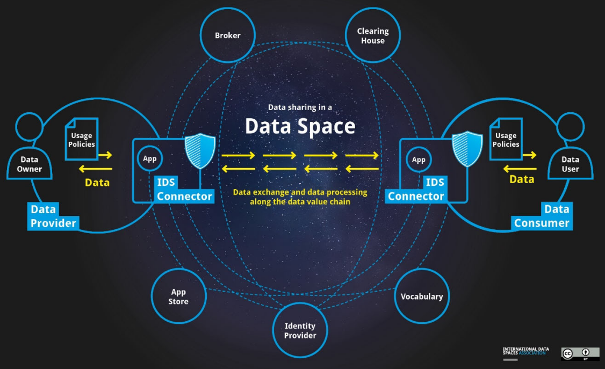

# Data spaces
Data spaces refer to structured and managed environments where data from various sources is securely stored, shared, and utilized for AI and robotics applications within smart and sustainable cities. These **data spaces are the project's core technology**, enabling participants to **access** and leverage **high-quality data for testing, experimentation, and validation of AI technologies**.

Data spaces support **interoperability**, ensuring that data from different sources can be combined and used while **complying with regulations** such as the GDPR and other EU directives. They provide the necessary infrastructure for managing data in a way that supports ethical considerations, cybersecurity, and the broader goals of creating a more digital and sustainable urban environment.

In Citcom.ai, data spaces are pivotal in accelerating innovation by facilitating collaboration among different stakeholders. They offer a **secure** and compliant framework for data exchange, ensuring that the **AI solutions developed within the project are both reliable and aligned with European standards**. This emphasis on innovation and the potential for significant progress is sure to excite the audience.

Basically, a data space must be formed, at least, by the following components: 

- **Trust Anchor (TA)**: Responsible for managing trust in the data space. It is the manager of the identities of the different elements of the data space and of managing the trust in them. At least one TA shall exist in the data space, managed by the organization in charge of the data space. 

- **Data Space Connector (DSC)**: Responsible for managing the communication between the different elements of the data space. It oversees managing authentication, authorization and data access control. There must be at least two DSCs, one per organization, to be able to affirm that a data space exists.

