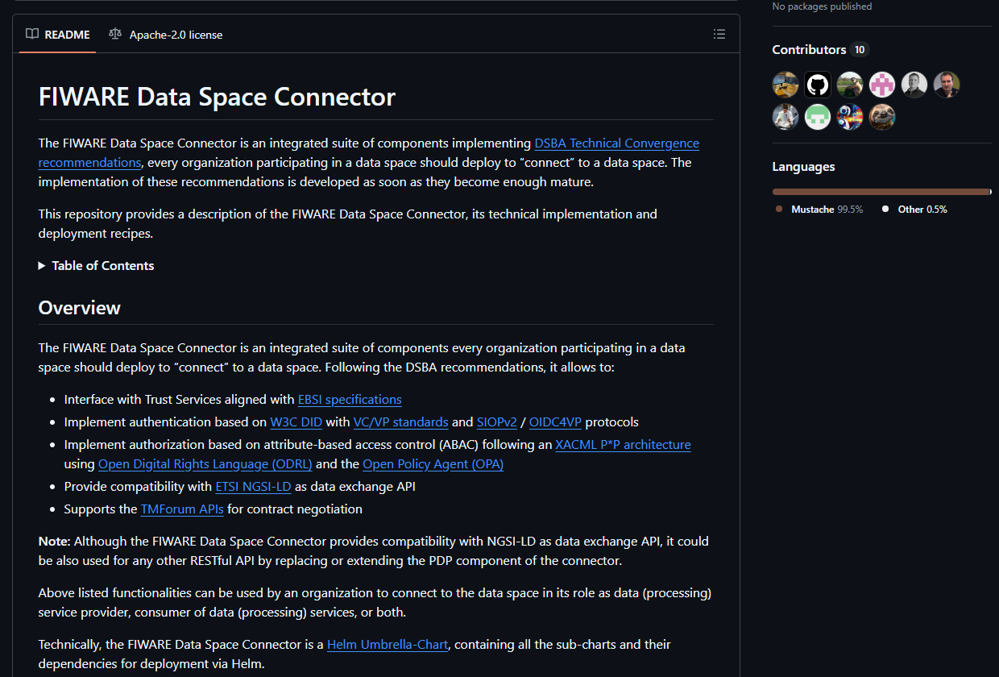

This page provides an introduction to the concept of data spaces, primarily using Fiware technology. Its main objective is to guide those interested in joining a data space from a technical perspective, giving them the necessary knowledge to understand what a data space is, how it works, and how they can participate in it.

!!! Warning "Before starting"

    It is recommended to have basic knowledge of [Kubernetes](https://kubernetes.io/), as most data space deployments are done in this environment. However, it is not necessary to be an expert to understand the concepts and follow the steps below.

    - Kubernetes:
        - [What is Kubernetes?](https://kubernetes.io/docs/concepts/overview/#what-kubernetes-is-not)
        - [Free course](https://kubernetes.io/training/)
    - [Helm](https://helm.sh/docs/): To understand it quickly, this is like pip packages (Python) but for Kubernetes (more or less).

## Basic Principles 

The initial adoption of the FIWARE Data Space technology within the CitCom.ai project is a strategic decision that aligns with old [Data Space Business Alliance](https://data-spaces-business-alliance.eu/) (DSBA) and the [Data Spaces for Smart Cities (DS4SCC)](https://www.ds4sscc.eu/) recommendations, ensuring a robust and interoperable framework for data exchange across Testing and Experimentation Facilities (TEFs).

For those interested in delving deeper into the technical pillars on which the Fiware Data Space Connector is developed, it is recommended to review the document: [DSBA Technical Convergence recommendations](https://data-spaces-business-alliance.eu/wp-content/uploads/2023/11/DSBA-Technical-Convergence-Recommendations.pdf). This document is the reference that Fiware uses for its developments. Although in some aspects it may be somewhat outdated, it is useful for a first contact.

<iframe 
    src="https://data-spaces-business-alliance.eu/wp-content/uploads/dlm_uploads/Data-Spaces-Business-Alliance-Technical-Convergence-V2.pdf" 
    width="100%" 
    height="600px">
</iframe>

Other interesting links to understand the basic concepts of data spaces and their implementation with Fiware are the different webinars that Fiware has on its YouTube channel. At first, it is recommended to watch these:

-  __FIWARE Vision on Data Spaces__

    <iframe 
        width="560" 
        height="315" 
        src="https://www.youtube.com/embed/phCPgxzT8t0?si=iXgbZDKqMn-zLl4Q" 
        title="FIWARE Vision on Data Spaces" 
        frameborder="0" 
        allow="accelerometer; autoplay; clipboard-write; encrypted-media; gyroscope; picture-in-picture; web-share" referrerpolicy="strict-origin-when-cross-origin" 
        allowfullscreen>
    </iframe>

- __Data Spaces – A Practical Introduction Into Roles and Components__ (up to minute 32, as the Local Minimal Viable Dataspace demo is not relevant at this point)

    <iframe 
        width="560" 
        height="315" 
        src="https://www.youtube.com/embed/hm5qMlhpK0g?si=LwYIbB7uEOd7N78d" 
        title="YouTube video player" 
        frameborder="0" 
        allow="accelerometer; autoplay; clipboard-write; encrypted-media; gyroscope; picture-in-picture; web-share" referrerpolicy="strict-origin-when-cross-origin" 
        allowfullscreen>
    </iframe>

-   [Smart Data Models](https://www.fiware.org/smart-data-models/) Other links of interest:

    - [https://smartdatamodels.org/](https://smartdatamodels.org/)

## Practical Case

Having a theoretical basis on what a data space is, its components and how it works, the next step is to put it into practice. For this, __it is recommended to deploy a data space locally__.

At the moment, the explanations focus solely on the __Fiware Data Space Connector:__ This is the [official repository](https://github.com/FIWARE/data-space-connector) of Fiware with the developments, the explanation of what a data space is and how the different components interact with each other.

### Option 1: Official Fiware Local Deployment

[Repository :simple-github:](https://github.com/FIWARE/data-space-connector/blob/data-space-connector-8.5.1/doc/deployment-integration/local-deployment/LOCAL.MD){:target="_blank" .md-button .md-button--primary-light }

    
This is the most complete example, but also the one that consumes the most resources. If your computer does not have enough resources, it may never deploy correctly. (As of March 17, 2026, the latest version is 8.5.1).

### Option 2: Minimum Viable Data Space Examples *(Recommended)*

[Repository :simple-github:](https://github.com/CitComAI-Hub/Minimum_Viable_DataSpace_Infrastructure/tree/develop){:target="_blank" .md-button .md-button--primary-light }

??? Note

    The Citcom.ai minimum viable data space is a reference implementation that has been developed to facilitate the understanding and deployment of what a data space is using Fiware technology. This example deploys __version 7.29.0__, a fully functional and stable version to understand the basic concepts of a data space.

    This development uses a different orchestration framework, which makes the deployment more controlled and ensures that it deploys correctly in more situations than the official Fiware deployment. 

You can follow the deployment instructions found in the [GitHub](https://github.com/CitComAI-Hub/Minimum_Viable_DataSpace_Infrastructure/blob/develop/README.md) repository to get the minimum viable data space up and running. This repository contains all the necessary information to carry out the deployment, including prerequisites, step-by-step instructions, and necessary resources.

As you can see, the repository contains different [examples](https://github.com/CitComAI-Hub/Minimum_Viable_DataSpace_Infrastructure/tree/develop/examples) of environments that have been developed.

| Example | Link | Description | 
| ------- | ---- | ----------- |
| __Minimal DS Local__ | [kind_minimal_ds_local](https://github.com/CitComAI-Hub/Minimum_Viable_DataSpace_Infrastructure/tree/develop/examples/kind_minimal_ds_local) | Minimal Data Space (FIWARE) deployment in a local Kind cluster. |
| Minimal DS Local + Raw Consumer | [raw_fiware_components-ds_local](https://github.com/CitComAI-Hub/Minimum_Viable_DataSpace_Infrastructure/tree/develop/examples/raw_fiware_components-ds_local) | Minimal Data Space (FIWARE) deployment in a local Kind cluster and a raw consumer. |
| Raw Consumer | [raw_fiware_consumer](https://github.com/CitComAI-Hub/Minimum_Viable_DataSpace_Infrastructure/tree/develop/examples/raw_fiware_consumer) | Raw Fiware consumer deployment (also with Trust Anchor). |
| Kind Cluster | [kind_cluster](https://github.com/CitComAI-Hub/Minimum_Viable_DataSpace_Infrastructure/tree/develop/examples/kind_cluster) | Kind cluster deployment. |
| K3s Cluster | [k3s_cluster](https://github.com/CitComAI-Hub/Minimum_Viable_DataSpace_Infrastructure/tree/develop/examples/k3s_cluster) | K3s cluster deployment. |

For a first contact, it is recommended to deploy the __Minimal DS Local__ example, which is the simplest and fastest to deploy. This example deploys a minimum viable data space using Fiware in a local Kind cluster. 

??? Tip "Advanced users"

    If you want to go a little deeper, you can deploy the __Minimal DS Local + Raw Consumer__ example, which in addition to the minimum viable data space, deploys a raw Fiware consumer, which allows you to better understand how a consumer should be configured from scratch.

You have all the instructions for the different services deployed in the example in the [repository](https://github.com/CitComAI-Hub/Minimum_Viable_DataSpace_Infrastructure/tree/develop/examples/kind_minimal_ds_local) itself. Once deployed and verified that everything works correctly, it is recommended to follow the [Fiware documentation](https://github.com/FIWARE/data-space-connector/blob/data-space-connector-7.29.0/doc/deployment-integration/local-deployment/LOCAL.MD) to test the interaction between the different components of the data space, such as data exchange between a provider and a consumer, identity and access management, etc.

## Other Resources

- __Decentralized IAM based on Verifiable Credentials and ODRL__

    <iframe 
        width="560" 
        height="315" 
        src="https://www.youtube.com/embed/zz7MHd3imzs?si=PUvwrMXwLHxLAx4L" 
        title="YouTube video player" 
        frameborder="0" 
        allow="accelerometer; autoplay; clipboard-write; encrypted-media; gyroscope; picture-in-picture; web-share" referrerpolicy="strict-origin-when-cross-origin" 
        allowfullscreen>
    </iframe>

- __Contract Negotiation in Data Spaces__

    <iframe 
        width="560" 
        height="315" 
        src="https://www.youtube.com/embed/kkvNQfkVJkg?si=9-WI1ghRf7IeEVVe" 
        title="YouTube video player" 
        frameborder="0" 
        allow="accelerometer; autoplay; clipboard-write; encrypted-media; gyroscope; picture-in-picture; web-share" referrerpolicy="strict-origin-when-cross-origin" 
        allowfullscreen>
    </iframe>