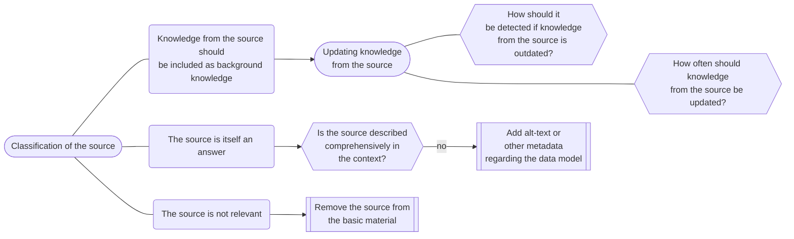

# Data Preparation

In order to use information sources for an AI, the information sources must be prepared for AI. 

This is an example of decision structures based on a specific case. In this case the primary information source is [loop.sundhedogomsorg.dk](http://loop.sundhedogomsorg.dk).
More specifically, the content created in the Drupal CMS system used to maintain "Loop" as a scientific source.
The information that lies outside Loop is referred to here as "external data".
The considerations below also apply to content hosted in Loop (videos, files) that are not "formatted" using the Drupal CMS system.
Relevant experiences for this have also been collected in
* [Processing docx with pandoc](pandoc_panflute_handle_docx.md)
* [Extracting URLs from Loop messages and downloading external data](urls_from_loop_messages.md)

## Background

Data is retrieved through semantic search from the database of the scientific source in chunks that are represented by a maximum of 500 tokens (approximately 300 words).
Alternatively, it can be retrieved through keyword search or graph-structured search (or any arbitrary other search method).
Ideally, only the knowledge from the scientific source that is identified through the search constitutes the background knowledge for the language model when a user question needs to be answered.
If the search is flawed, so that irrelevant knowledge is found and included as background knowledge for the language model, there is a high probability that it will confuse the model and lead to incorrect, misleading answers or simply imprecise answers.
It is therefore important that the knowledge from the source is represented as well as possible in order to retrieve the relevant knowledge and provide the model with the right context to answer from.

## Challenges

There are basically two challenges in ensuring that it is possible to include knowledge from external knowledge sources as background knowledge for a language model.
1. Getting text and illustrations out of a document in the order the author intended.
   It is about reading the file format in which the knowledge is stored.
   Classic examples: _Text in columns in a PDF document is set up so that the text is extracted with alternating lines from each of the columns._
   Or in a scrape from a website, where _text under headings or lists is folded together via JavaScript or similar, so that it only appears from the HTML source when they are unfolded_ or where _a small section with important information floats out in a margin, visually in front of a relevant section, but declared in a completely different place in the source_.
   So given that your source is a PDF document
   ```mermaid
   flowchart LR
   pdf("PDF")
   pdfcol{{"Are there multiple<br>columns in the source"}}
   colchk{{If the text is marked<br>across columns,<br>does the marking follow the<br>natural reading logic?}}
   note[["Note in<br>source/data<br>report"]]
   pdf --> pdfcol
   pdfcol -- yes --> colchk
   colchk -- yes/no --> note
   ```
2. Understanding the implicit logic in how the author has structured knowledge in the document.
   Examples: _Is a heading and/or the text after a heading important to frame all the following subsections or is it better that each individual section stands alone?_
   ```mermaid
   flowchart LR
   txt(Tekst)
    -->
   tsec{{"Are there sections,<br>where the text can be<br>split up with advantage"}}
    -- yes -->
   secexpl{{"Can the sections stand<br>alone? (are they self-explanatory)"}}
    -- no -->
   logic{{"How is the logic in<br>the text?"}}
    --- suphd{{"Does the super-heading frame the section?"}}
   logic --- intr{{"Is there an introduction that frames the section?"}}
   logic --- otsec{{"Other sections are necessary <br> to frame the section"}}
   suphd & intr & otsec -- yes --> note[["Note in<br>source/data<br>report"]]
   logic --- else{{Other?}} --- note
   ```
   Or is a _table a collection of data points with different attributes or a 2-dimensional table, where there is both a column and row index that frames a text in the relevant cell._
   A very clear example of a 2-dimensional table can be found in
   [Overview of documentation of health and functional status](https://loop.sundhedogomsorg.dk/helhedsvurdering-indhold-og-ansvar),
   where the table above has more of a 1-dimensional table character.
   In [Handling of services when moving](https://aarhuskommune.sharepoint.com/:w:/s/IntranetDocumentSite/EWnGFoQvqJJGiuGtWFc8cxABXuvXxHi-d8ictUsvY6Zt9w?rtime=7ymVjG_k3Eg)
   we have an example of something that is almost a 3-dimensional table,
   divided into several 2D tables, but where the table headings constitute the third axis. The column headings are repeated on all tables and many of the row headings are also repeated between the tables.
In addition, a very important 3rd challenge that is only relevant when referring to external websites/knowledge collections
3. Does a reference to a website only refer to the specific page and the content in the primary box(es) (i.e. not a possible menu or footer) or is it a reference to all pages under the domain? Or even worse, maybe even some links away from the domain? Or just a series of logically related pages under the domain?
   If your source is a website (also in conjunction with point 1):
   ```mermaid
   flowchart LR
   web(website)
   web2{{"Is it a single page<br>or do you need to navigate<br>around on multiple<br>subpages/links?"}}
   web3{{"How is<br>the source material delimited on the site"}}
   web4{{"Should information be unfolded - e.g. sub-items<br>where body text appears<br>when clicked"}}
   note[["Note in<br>source/data<br>report"]]
   web --> web2
   web --> web4
   web2 -- multiple
          subpages --> web3
   web3 --> note
   web4 --> note
   ```
The difference between the primary scientific source and external data is that the RAG solution is built for/by those who have made all these editorial choices for the primary scientific source and that this contains a large amount of relevant knowledge. Therefore, it _always_ pays to design/write a data extraction script/procedure. For the external data, many different choices may have been made, so there are many different situations that need to be addressed, and there is not necessarily much material that is covered by the structure that is covered.
Therefore _it_ may make more sense that it is a manual process to extract text and knowledge from a given knowledge source depending on type and quantity, but in some cases it also makes good sense that it is a script, as this also ensures a form of documentation of how a source has been treated.
Finally, there is the question of updates - how often is external information updated, and how do you find out that it has been updated.
- Is it textbook knowledge that can be considered static (until a user perhaps complains about incorrect information - a newly hired person pointing out that it is no longer recommended practice - RICE vs PRICEM)
- Are there updates from time to time that should be caught, new decisions from e.g. the appeals board, or organizational or procedural changes (own doctor's responsibility vs. hospital's responsibility)
- What happens when the format changes, docx becomes pdf or a dynamic website?

## Overall handling of the sources

Start by collecting all data sources (preferably with a reference to where there is a reference to the relevant data source in the primary scientific source).
A domain expert should categorize all source material according to
1.
   - Should the knowledge be included as background knowledge for the language model?
     Remember that the language model is not just a newly hired person, it is not at all educated in the field. Maybe textbook material that assumes knowledge among employees should be included even if it is not referenced in the primary knowledge database.
   - Is the source itself an answer?
     For example, a form or contact information that the language model should give directly as a link to the user.
     If it is, for example, a form, is there a guide to the form that the language model should be able to draw on or should the model also have access to information in the form so that it can answer questions down in the form.
     - Is the source introduced comprehensively in the context?
     - Should 'alt-text' or other metadata about the source be added that the language model should have access to in order to understand what a user can and should use the source for?
   - Is the source redundant?
     In that case, it should probably be removed completely from the primary scientific source
2.
   - How can/should it be detected/investigated whether knowledge in the source is updated
   - How often should knowledge from the source be updated

A data-savvy person should now clarify
3.
   - In which "file" formats is knowledge stored?
     - CMS system/database, pdf, docx, png, mpeg, APIs, websites
   - In which data "modalities" is knowledge stored?
     - (Plain text,) formatted text, tables (1D or 2 or multi-dimensional), floating text boxes, graphs, diagrams, images, sound, video, interactive material (websites), functions/scripts
   - What data structure/data model should be the basis for knowledge that should be available to the language model?
     - See the section [Data structure/data model](#datastrukturdatamodel) below
   _All this can be crucial for whether a RAG solution is sufficient or whether an agent-based solution is necessary. Which in turn can have a major impact on how quickly the model responds and thus the user experience_
After that, the sources should be grouped according to whether the text "just" can be extracted, i.e. consists of plain text, formatted text, where the division is clear to the tool used or where illustrations/figures do not contribute with information that is not already in the text. Alternatively, the sources must be processed manually. If there are sources that resemble each other, they can be grouped together and processed together.

### Data structure/data model

Under all circumstances, it is important to have a data structure or data model to which you want your source material (both internal and external) formatted.
This ensures a systematic and well-documented representation of knowledge.
Depending on whether you have a clear idea of how a RAG solution should be built up and therefore which data structure is necessary or would like to represent all the knowledge/structure that is in the source material, you can choose
- a minimal data structure/model that contains the information necessary for the given RAG design
- a maximal data structure or data model that enables a representation of the knowledge that the sources contain.
Clarification of data model
- How should sources be referenced?
- Should the sources be split up?
  - Because a source contains information/sections that to a large extent are independent of each other, so you would confuse a language model by inserting the entire source as background knowledge for a given question.
  - Because the text in the source is too long to be encoded (in relation to semantic search). Here it is also possible to encode a summary of the text, if the information can be summarized in a meaningful way on the number of tokens the encoder model allows
- Should images, figures and possibly tables be included as extra data that can be presented to the user without the language model having related to the image, the figure, except that an 'alt-text' or other form of description is available
- Should there be connections between the data points (the source fragments) - i.e. a form of graph network.
- ...
### Flowchart

```mermaid
flowchart TB
    q_clas([Classification of the source])
    c_incl("Knowledge from the source should<br>be included as background knowledge")
    q_upd([Updating knowledge<br>from the source])
    q_how{{"How should it<br>be detected if knowledge<br>from the source is outdated?"}}
    q_when{{"How often should knowledge<br>from the source be updated?"}}
    ftype([Digital data format])
    pw{{"Is the data format protected<br>(password, rights)"}}
    subgraph dfmt ["In which format is knowledge stored?"]
        direction LR
        subgraph opt [" "]
            web(website)
            txt("plain text (txt)")
            md("simple formatting<br>(md, rst)")
            doc("Word processor (docx, odt)")
            indd("Graphic layout (indd, sla)")
            pdf("PDF")
            img("Image (jpg, png, tiff)")
            svg("Vector graphics (svg)")
            xls("Spreadsheet (xlsx, csv)")
            wav("Sound (wav, mp3, flac)")
            mpeg("Video (mpeg)")
            json("Plain text structured<br>data (json, xml, yaml)")
            db(Database/CMS system/API)
        end
        web2{{"Is it a single page<br>or do you need to navigate<br>around on multiple<br>subpages/links?"}}
        web3{{"How is<br>the source material delimited on the site"}}
        web4{{"Should information be unfolded - e.g. sub-items<br>where body text appears<br>when clicked"}}
        note[["Note in<br>source/data<br>report"]]
        web --> web2
        web --> web4
        web2 -- multiple
                subpages --> web3
        db --> db2
        db --> db3
        pdf --> pdfcol
        pdfcol -- yes --> colchk
        colchk -- yes/no --> note
        db2 ---> note
        db3 ---> note
        web3 --> note
        web4 --> note
        opt ---> note
        %%fmt --- web
        %%fmt --- fmtopt
        %%fmt --- db
    end
    modal([Data modalities])
    subgraph mod ["Which (knowledge-bearing) elements are contained in the source?"]
        direction LR
        subgraph col [" "]
            subgraph textcol ["Text"]
                clean(Only plain text)
                text("formatted text<br>(headings, emphasis,<br>lists)")
                box(Floating text boxes)
            end
            subgraph figcol ["Visual elements"]
                tbl(Tables)
                pic(Images)
                ill("Graphs/Diagrams<br>/Flowcharts")
                intact("interactive material<br>/functions/scripts")
            end
            subgraph dyncol ["Dynamic elements"]
                snd(Sound)
                vid(Video)
            end
        end
        pres{{"Should the element<br>be presented directly<br>to a user?"}}
        trans{{"Should the element<br>be transcribed?"}}
        condesc{{"Is the element described<br>sufficiently in the context?"}}
        eledesc[["Add alt-text or<br>other metadata<br>regarding the data model"]]
        tbltp(["What type of table?"])
        tbl1D("1D (collection of rows)")
        tbl2D("Multidimensional (2D)")
        elelab{{Is there a label/description}}
        ign{{"Is it important <br>(background) info or<br>can it be ignored"}}
        rel{{"Which (text) elements<br>is info linked to"}}
        tsec{{"Are there sections,<br>where the text can be<br>split up with advantage"}}
        logic{{"How is the logic in<br>the text: Are<br>super-headings,<br>introductions, other sections<br>necessary to<br>frame a section"}}
        funcdesc{{Is it essential that<br>the solution has access<br>to the functional<br>description}}
        func[[Develop or get<br>access and integrate<br>a suitable solution]]
        note2[[Note in<br>source/data<br>report]]
        textcol --> tsec --> logic --> note2
        tbl --> tbltp
        tbltp --- tbl1D & tbl2D
        figcol --> elelab
        tbl1D & tbl2D --> note2
        col --> note2
        elelab ---> note2
        box --> ign
        ign -- important --> rel --> note2
        ign -- "ignore
                 (quotes/highlights/
                 examples)" ---> note2
        figcol & dyncol  --> pres & condesc
        pres --> note2
        dyncol --> trans
        condesc -- no --> eledesc
        trans -- yes --> eledesc
        ill & intact --> funcdesc -- yes --> func
    end
    c_ans(The source is itself an answer)
    q_compl{{"Is the source described<br>comprehensively in<br>the context?"}}
    add_alt[["Add alt-text or<br>other metadata<br>regarding the data model"]]
    c_skip(The source is not relevant)
    rem[["Remove the source from<br>the basic material"]]
    done[[Done]]
    q_clas ------ c_incl
    q_clas --- c_ans & c_skip
    c_incl --> q_upd
    q_upd --- q_how
    q_upd ---- q_when
    c_incl -----> ftype
    ftype --- pw
    ftype ---- dfmt
    c_incl --------> modal
    modal --> mod
    c_ans --> q_compl
    q_compl -- yes --> done
    q_compl -- no --> add_alt
    c_skip --> rem
```

### Alternative design of flowchart
<!-- %%{init: {"flowchart": {"defaultRenderer": "elk"}, "elk": {"mergeEdges": true, "nodePlacementStrategy": "BRANDES_KOEPF", "cycleBreakingStrategy": "GREEDY_MODEL_ORDER"}}}%% -->
```mermaid
flowchart TB
    %%q_clas([Classification of the source])
    c_skip{{Is the source relevant}}
    rem[["Remove the source from<br>the basic material"]]
    c_skip -- no --> rem
    c_ans{{Is the source itself an answer?}}
    c_skip -- yes --> c_ans
    q_compl{{"Is the source described<br>comprehensively in<br>the context?"}}
    c_ans -- yes --> q_compl
    done[[Done]]
    q_compl -- yes --> done
    add_alt[["Add alt-text or<br>other metadata<br>regarding the data model"]]
    q_compl -- no --> add_alt
    c_incl[["Knowledge from the source should<br>be included as background knowledge"]]
    c_ans -- no --> c_incl
    q_how[["Note how it<br>should be detected if knowledge<br>from the source is outdated?"]]
    c_incl --> q_how
    q_when[["Note how often knowledge<br>from the source should be updated?"]]
    q_how --> q_when
    ftype([Digital data format])
    q_when --- ftype
    pw{{"Is the data format protected<br>(password, rights)"}}
    ftype --> pw
    pw_acc[[Note who can ensure the solution access to the source]]
    pw_acc_c[[Note interested parties regarding securing the source's content in the solution]]
    pw -- yes --> pw_acc
    pw_acc --- pw_acc_c
    dfmt([source file format:])
    pw_acc_c --> dfmt
    pw -- no --- dfmt
    web{{Is the source a website?}}
    dfmt --> web
    web2{{"Is it a single page<br>or do you need to navigate<br>around on multiple<br>subpages/links?"}}
    web -- yes --> web2
    web3[["Note how the source material<br>is delimited on the site?"]]
    web2 -- multiple
            subpages --> web3
    web4[["Note if information should<br>be unfolded - e.g. sub-items<br>where body text appears<br>when clicked"]]
    web2 -- single page --> web4
    web3 --> web4
    txt{{"Is the source stored<br>as plain text (.txt)"}}
    web -- no ----> txt
    md{{"Is the source stored with<br>simple formatting<br>(.md, .rst, ...)"}}
    txt -- no --> md
    doc{{"Is the source stored in<br>a word processor format<br>(.docx, .odt, ...)"}}
    md -- no --> doc
    indd{{"Is the source graphic<br>layout (.indd, .sla, ...)"}}
    doc -- no --> indd
    pdf{{"Is the source a PDF"}}
    indd -- no --> pdf
    pdfcol{{"Are there multiple<br>columns in the source"}}
    pdf -- yes --> pdfcol
    colchk[[Note if a text marking<br>across columns follows<br>the natural reading logic?]]
    pdfcol -- yes --> colchk
    img{{"Is the source an image<br>(.jpg, .png, .tiff, ...)"}}
    pdf -- no --> img
    svg{{"Is the source vector<br>graphics (.svg, ...)"}}
    img -- no --> svg
    xls{{"Is the source a spreadsheet<br>(.xlsx, .csv, ...)"}}
    svg -- no --> xls
    wav{{"Is the source sound<br>(.wav, .mp3, .flac, ...)"}}
    xls  -- no --> wav
    mpeg{{"Is the source video<br>(.mpeg, ...)"}}
    wav -- no --> mpeg
    json{{"Is the source plain<br>text structured data<br>(.json, .xml, .yaml, ...)"}}
    mpeg -- no --> json
    db{{Is the source a database/CMS system/API}}
    json -- no --> db
    db2[["Note which entities<br>should be extracted?"]]
    db -- yes --> db2
    db3[[Note how they are extracted]]
    db2 --- db3
    wtf[[What the hell is the source then? Note!]]
    db -- no --- wtf
    modal(["Source (knowledge-bearing) elements:"])
    txt & md & doc & indd & img & svg & xls & wav & mpeg & json -- yes --> modal
    web4 & db3 & wtf & colchk --> modal
    pdfcol -- no --> modal
    clean{{Does the source contain only plain text?}}
    modal --> clean
    text{{"Does the source contain formatted text<br>(headings, emphasis,<br>lists)"}}
    clean -- no --> text
    tsec{{"Are there sections,<br>where the text can be<br>split up with advantage"}}
    text -- yes --> tsec
    logic[["Note any logic in<br>the text: Are<br>super-headings,<br>introductions, other sections<br>necessary to<br>frame a section"]]
    tsec -- yes --> logic
    loop(["For the next (knowledge-bearing) element:"])
    text -- no --> loop
    tsec -- no --> loop
    logic --> loop
    box{{Is it a floating text box?}}
    loop --> box
    ign{{"Is it important <br>(background) info? (or<br>can it be ignored)"}}
    box -- yes --> ign
    rel[["Note which (text) elements<br>info is linked to"]]
    ign -- important --> rel
    tbl{{Is it a table?}}
    box -- no --> tbl
    tbltp[["Note what type<br>table it is, 1D<br>(collection of rows)<br>or multidimensional/2D"]]
    tbl -- yes --> tbltp
    %% tbllab{{Is there a label/description}}
    %% tbltp --> tbllab
    %% tblmeta[[Add to metadata]]
    %% tbllab -- yes --> tblmeta
    %% tblcon{{"Is the element described<br>sufficiently in the context?"}}
    %% tbllab -- no --> tblcon
    %% tbldesc[["Add alt-text or<br>other metadata<br>regarding the data model"]]
    %% tblcon -- no --> tbldesc
    %% tblpres[["Note if the element<br>should be presented directly<br>to a user"]]
    %% tbldesc & tblmeta --> tblpres
    ill{{"Is it a Graph/Diagram<br>/Flowchart"}}
    tbl -- no --> ill
    %%illlab{{Is there a label/description}}
    %%ill -- yes --> illlab
    %%illmeta[[Add to metadata]]
    %%illlab -- yes --> illmeta
    %%illcon{{"Is the element described<br>sufficiently in the context?"}}
    %%illlab -- no --> illcon
    %%illdesc[["Add alt-text or<br>other metadata<br>regarding the data model"]]
    %%illcon -- no --> illdesc
    %%illpres{{"Should the element<br>be presented directly<br>to a user?"}}
    pic{{Is it an image?}}
    ill -- no --> pic
    %% piclab{{Is there a label/description}}
    %% pic -- yes --> piclab
    %% piccon{{"Is the element described<br>sufficiently in the context?"}}
    %% piclab -- no --> piccon
    %% picdesc[["Add alt-text or<br>other metadata<br>regarding the data model"]]
    %% piccon -- no --> picdesc
    %% picpres{{"Should the element<br>be presented directly<br>to a user?"}}
    snd{{Is it sound?}}
    pic -- no --> snd
    trans[["Note if the element<br>should be transcribed?"]]
    snd -- yes --> trans
    %% sndlab{{Is there a label/description}}
    %% snd -- yes --> sndlab
    %% sndcon{{"Is the element described<br>sufficiently in the context?"}}
    %% sndlab -- no --> sndcon
    %% snddesc[["Add alt-text or<br>other metadata<br>regarding the data model"]]
    %% sndcon -- no --> snddesc
    %% sndpres{{"Should the element<br>be presented directly<br>to a user?"}}
    vid{{Is it video?}}
    snd -- no --> vid
    vid -- yes --> trans
    %% vidtrans{{"Should the element<br>be transcribed?"}}
    %% vidlab{{Is there a label/description}}
    %% vid -- yes --> vidlab
    %% vidcon{{"Is the element described<br>sufficiently in the context?"}}
    %% vidlab -- no --> vidcon
    %% viddesc[["Add alt-text or<br>other metadata<br>regarding the data model"]]
    %% vidcon -- no --> viddesc
    %% vidpres{{"Should the element<br>be presented directly<br>to a user?"}}
    intact{{"Is it interactive material<br>/functions/scripts?"}}
    vid -- no --> intact
    funcdesc{{Is it essential that<br>the solution has access<br>to the functional<br>description}}
    intact -- yes --> funcdesc
    func[[Develop or get<br>access and integrate<br>a suitable solution]]
    funcdesc --> func
    %% intlab{{Is there a label/description}}
    %% intact -- yes --> intlab
    %% intcon{{"Is the element described<br>sufficiently in the context?"}}
    %% intlab -- no --> intcon
    %% intdesc[["Add alt-text or<br>other metadata<br>regarding the data model"]]
    %% intcon -- no --> intdesc
    %% intpres{{"Should the element<br>be presented directly<br>to a user?"}}
    wtf2[[What the hell is the source then? Note!]]
    intact -- no --> wtf2
    elelab{{Is there a label/description}}
    tbltp & trans & func & wt
