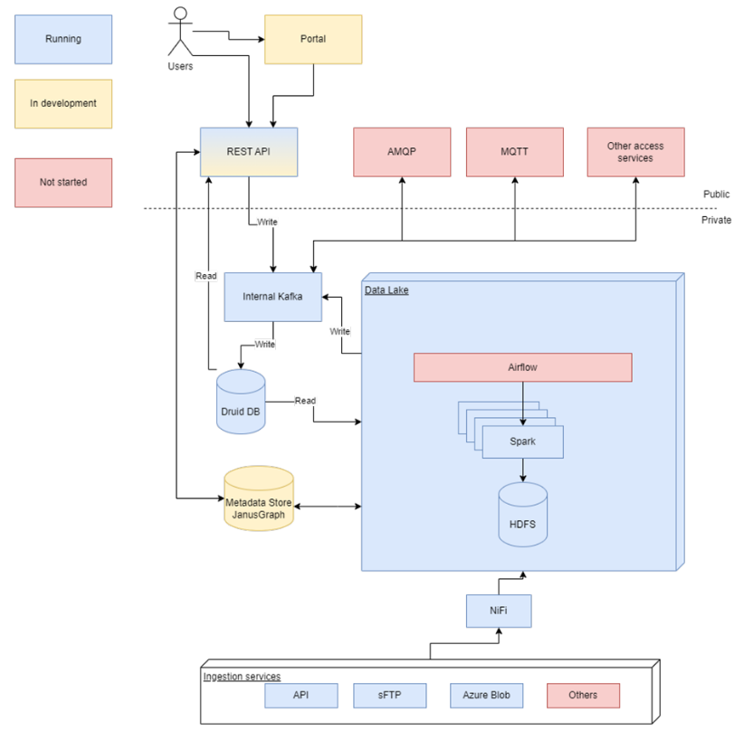
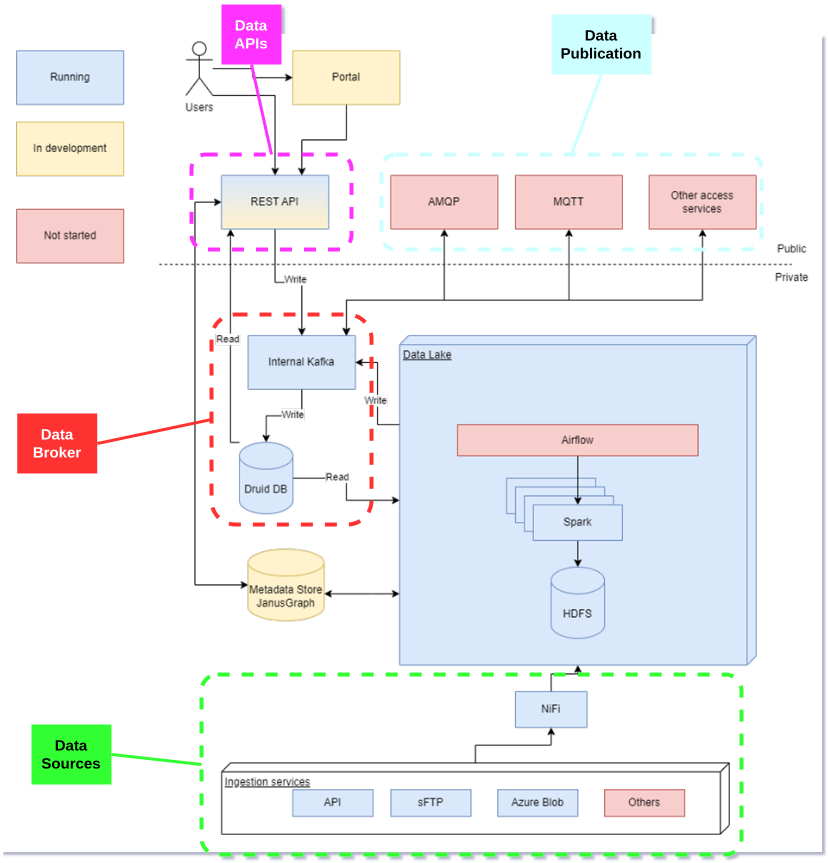

## Overview

Center Denmark is located in Fredericia, Denmark, and serves as a national hub for digitalization across the utility sector. As a TEF Site in the CitCom.ai project, Center Denmark focuses on enabling AI-driven innovation by providing access to high-quality, real-world data from electricity, water, and heating systems (including gas and PtX where relevant).

Center Denmark provides secure and structured data infrastructure that supports collaboration between utilities, AI innovators, and researchers. The site plays a central role in bridging the gap between data availability and AI application by making validated utility datasets accessible for development, testing, and scaling of smart solutions that support the green transition.

**In short:** Center Denmark provides access to high-quality utility data through a dedicated data portal, offering both downloadable datasets and API-based access – ready for use in AI, analytics, and research.

## Services Offered

List the services available at the TEF Site related to the CitCom.ai Services Catalog. Provide a brief description of each service, and include any relevant links or documentation.

- **Service 1**: [Description of Service 1]
- **Service 2**: [Description of Service 2]
- **Service 3**: [Description of Service 3]

## Infrastructure Components

Center Denmark provides the core infrastructure necessary to make high-quality utility data accessible, usable, and legally compliant for AI development, research, and innovation.  
The infrastructure is built to support both technical and legal aspects of data sharing, ensuring that stakeholders can focus on value creation without complexity or risk.

### Data Platform  
Center Denmark operates a national data platform that collects, processes, and structures data from electricity, water, heating, gas, and PtX systems.  
In addition to utility data, the platform also integrates **public data sources** such as:

- Weather data  
- Building information (BBR)  
- Electricity spot prices  
- Demographic data

The platform ensures that all data is securely ingested, cleansed, enriched, and pseudonymised in accordance with GDPR, and prepared for use in AI, analytics, and research.

### Data Portal  
The data portal is the primary access point for users, offering both **downloadable datasets** and **API-based access**.  
Through the portal, users can browse available data, configure tailored datasets, or access open datasets for prototyping and exploration. The portal ensures structured and efficient access to high-quality utility data.

### Legal and Governance Support  
To ensure responsible and compliant data sharing, Center Denmark provides **legal assistance and standardized templates** that help define the correct legal basis for data access and publication.  
This includes support with data processing agreements, joint controller agreements, and consent management – collectively known as the **“fullmagtparadigme”**.

<table>
  <tr>
    <th colspan="2" style="text-align: center;">Specifications</th>
  </tr>
  <tr>
    <td><strong>Data Broker<strong></td>
    <td>
      {{ config.extra.labels.data_brokers.kafka }} 
      <strong>- API:</strong> {{ config.extra.labels.api_brokers.custom }} 
      <strong>- Version:</strong>&lt;no_specified\>
    </td>
  </tr>
  <tr>
    <td><strong>Data Source<strong></td>
    <td>Nifi</td>
  </tr>
  <tr>
    <td><strong>IdM &amp; Auth<strong></td>
    <td>&lt;no_specified\></td>
  </tr>
  <tr>
    <td><strong>Data Publication<strong></td>
    <td>MQTT, AMQP</td>
  </tr>
</table>

### Architecture

Provide a high-level overview of the architecture of the TEF Site, including the key components and technologies used. Include any relevant diagrams or visualizations to help stakeholders understand the infrastructure.

### European Data Space for Smart Communities (DS4SSCC)

{{ config.extra.labels.ds4ssc_compliant.yes_comp.data_sources }} {{ config.extra.labels.ds4ssc_compliant.yes_comp.data_broker }} {{ config.extra.labels.ds4ssc_compliant.yes_comp.data_api }} {{ config.extra.labels.ds4ssc_compliant.no_comp.data_idm_auth }} {{ config.extra.labels.ds4ssc_compliant.yes_comp.data_publication }}

## Relevant datasets of the site

Describe the relevant datasets available at the site

- **Dataset_1**: [Description of the data set and link to Data Catalog: eg https://citcomai-hub.github.io/data_catalog/metadata_datasets/south_spain_valencia/]
- **Dataset_2**: [Description of the data set and link to Data Catalog: eg https://citcomai-hub.github.io/data_catalog/metadata_datasets/south_spain_valencia/]
- **Dataset_3**: [Description of the data set and link to Data Catalog: eg https://citcomai-hub.github.io/data_catalog/metadata_datasets/south_spain_valencia/]

## Key Stakeholders and Partners

Provide a list of the key stakeholders and partners involved in the TEF Site. Include any academic institutions, industry collaborators, and other stakeholders.

- **Stakeholder 1**: [Name and description of the stakeholder, e.g., university, research institute, industry partner]
- **Stakeholder 2**: [Description]
- **Stakeholder 3**: [Description]

## Contact Information

Provide contact details for those responsible for the TEF Site or who can provide more information to collaborators or users.

- **Site Coordinator**: [Name and contact details]
- **Technical Support**: [Name and contact details]
- **General Inquiries**: [Name and contact details]

## Additional Information

Any other relevant information that might be useful to collaborators or developers working with the TEF Site, such as specific protocols, access instructions, or unique capabilities.

Example:
The TEF Site offers unique capabilities in [specific field], and it is open to collaboration with other EU projects in the area of [related field].

## Documentation and Resources

Link to any relevant documentation or resources, such as technical specifications, API documentation, or guides for using services at the TEF Site.

- [Documentation Link 1](#)
- [Documentation Link 2](#)

---

!!! info
    This page is part of the documentation hub for the CitCom.ai project. Please ensure that the information is up-to-date and accurate.
