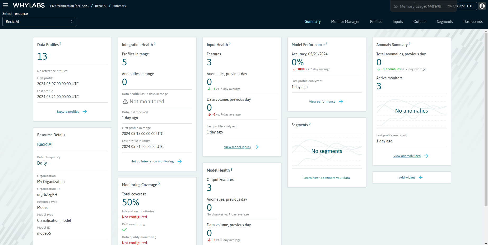
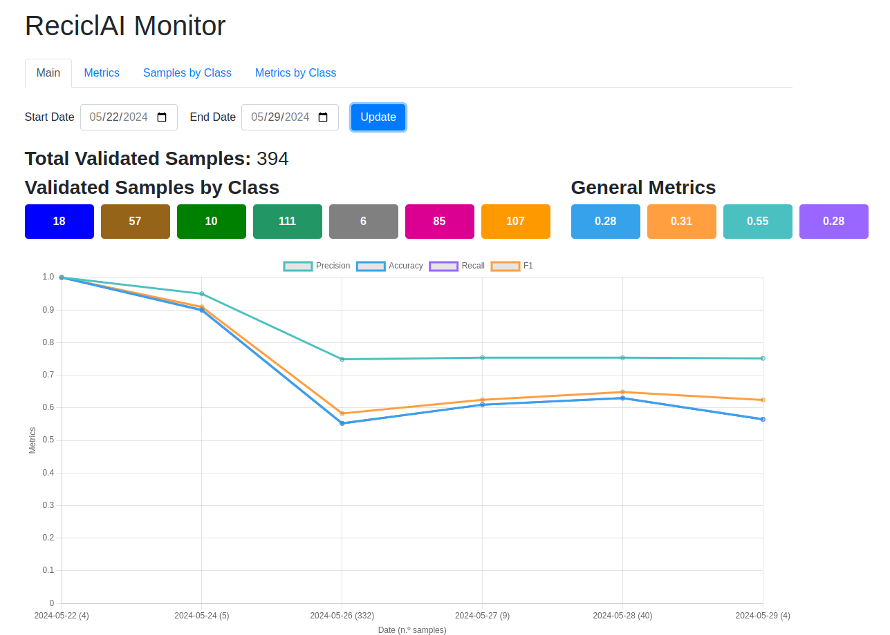

# AI system Logging & Monitor
[Repository :simple-github:](https://github.com/RECICLAI-VRAIN/ia-logging-monitor){ .md-button .md-button--primary-light }

## How to use

1. Download or clone repository.
2. Run `pip install -r requeriments.txt` + Enter.
3. Run the `deploy.sh` file, which deploys each service independently:
   - The logging (external) can be consulted at [WhyLabs](https://whylabs.ai/).
   - The monitor interface (internal) can be consulted on port `5004`.

## Previous considerations 

For the operation of the Logging and Monitor modules, the ones exposed in this repository, it is necessary a database that stores the predictions and revisions in the expected way, this is:

- `filename`: (string) base name of the image.
- `output_confidence`: (float) (optional) confidence of the max class predicted.
- `output_prediction`: (int) predicted class.
- `output_validated`: (bool) if it is validated the prediction.
- `timestamp`: (string/timestamp) timestamp of the prediction.
- `trained`: (bool) (optional) if it is already used for retraining.
- `logged`: (bool) if is is already logged to the external logging.
- `timestamp_validated`: (string/timestamp) timestamp of the validation.

A MongoDB has been used in the implementation. If you wish to use another database, it would be necessary to update the corresponding part of the code, maintaining the described structure.

##  Logging (External)

The Logging module tracks the model's performance in production. It logs various performance metrics, including accuracy, precision, recall, and the number of predictions made over time. A monitoring platform visualizes these metrics, helping identify trends and potential issues. Additionally, this module monitors the system for any anomalies or significant drops in performance, triggering alerts when necessary to ensure the model remains reliable and any problems are promptly addressed.

### Key features

Key features of the module include performance logging, drift detection, data storage, and scheduling.

- **Performance logging** involves logging various aspects of the classification model's performance.
- **Drift detection** identifies any changes in the model's performance over time.
- **Data storage** ensures that logged performance metrics and related metadata are stored in a database, providing a robust system for retrieving and analyzing historical performance data.
- A **scheduler** ensures regular monitoring tasks, ensuring continuous and timely monitoring of the model's performance.

### Functionalities

The module's functionalities include environment configuration, database connection, monitoring tasks, scheduler initialization, and error handling.

- **Environment configuration** involves setting environment variables for the monitoring platform.
- **Database connection** uses the provided URI and database name to establish a connection to the database, ensuring reliable database access.
- The **monitoring task** fetches new entries from the database and logs their performance metrics, integrating with the logging platform to create and store performance logs.
- **Scheduler initialization** sets up a blocking scheduler to run the monitoring task regularly, ensuring the monitoring process runs continuously without manual intervention.
- **Error handling** entails logging errors encountered during database connection and monitoring tasks, and providing feedback on the status of the monitoring process.

### Implementation

The module has been implemented using WhyLogs and WhyLabs. [WhyLogs](https://whylabs.ai/whylogs) is a logging library that captures various performance metrics, and [WhyLabs](https://whylabs.ai/whylogs) is a platform that helps identify trends and potential issues.

## Monitor (Internal)

The Monitor module is designed to track the performance of the classification model in production. Using charts, it provides a web interface that visualizes various performance metrics over a selected time range. The module utilizes a web framework for the backend, a database for data storage, and a charting library for creating interactive charts.

### Key features

Key features of this module include a web interface, data fetching, and charts.

- The **web interface** allows users to monitor model performance through various tabs.
- **Data fetching** retrieves logs based on user-specified date ranges, and performance metrics such as precision, accuracy, recall, and F1 score are calculated.
- **Interactive charts** visualize these metrics, including line charts for overall metrics and bar charts for class-specific metrics.

### Functionalities

The detailed functionalities include environment configuration, database connection, metrics calculation, chart initialization, and web interface tabs.

- **Environment configuration** involves setting up connection details for the database.
- A **connection to the database** is established using the provided URI and database name, and data is fetched based on the user-specified date range.
- **Metrics calculation** computes daily precision, accuracy, recall, and F1 score, which are then aggregated to provide an overall performance view.
- **Chart initialization** visualizes these metrics, with line charts for daily metrics and bar charts for metrics by class.

### Web interface tabs

The web interface includes several tabs:

- The **main tab** provides an overview of the validated samples and metrics.
- The **metrics tab** displays separate line charts for precision, accuracy, recall, and F1 score.
- The **samples by class tab** features a pie chart of validated samples by class.
- The **metrics by class tab** displays bar charts of precision, recall, and F1 score by class.
- The **training data tab** includes a pie chart of samples by class from the training dataset.

### Implementation

The module has been implemented using Flask and [Chart.js](https://www.chartjs.org/), a JavaScript library for creating interactive charts.

## Alternatives

Additionally, other libraries and platforms were considered:

- [Evidently](https://www.evidentlyai.com/), a tool for evaluating and monitoring the performance of machine learning models, providing detailed reports and visualizations of model metrics.
- [Grafana + Prometheus](https://prometheus.io/docs/visualization/grafana/), where Grafana is an open-source platform for monitoring and observability, providing dashboards and visualizations, and Prometheus is a monitoring system and time-series database that collects metrics and data.
- [alibi-detect](https://docs.seldon.io/projects/alibi-detect), a library focused on detecting outliers, adversarial instances, and concept drift in machine learning models, ensuring the robustness and reliability of the deployed models.

